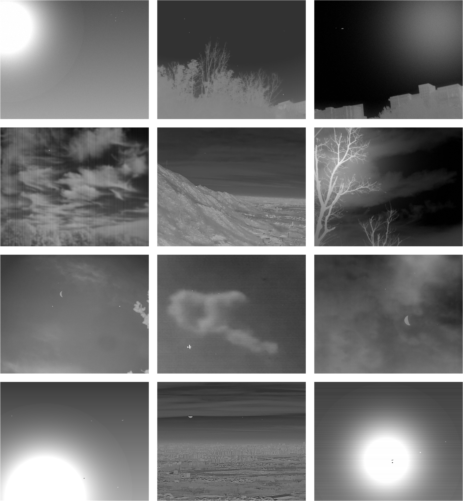
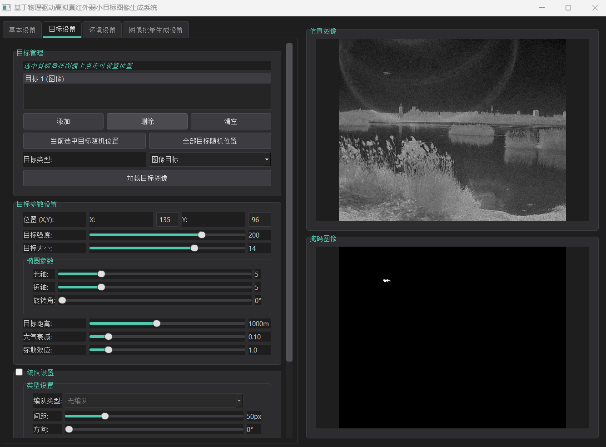
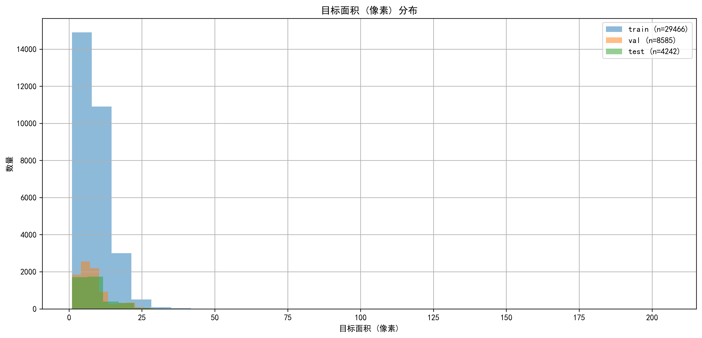
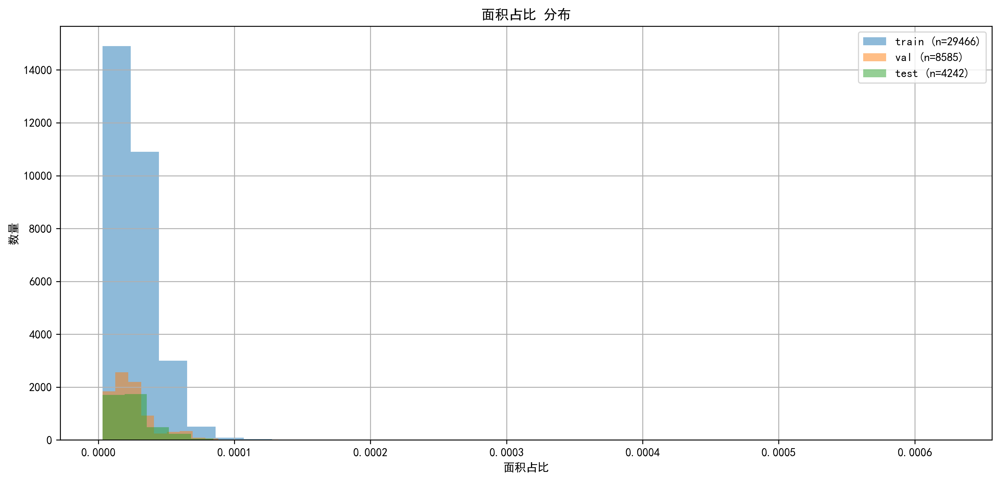
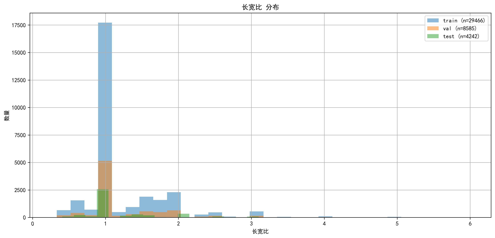
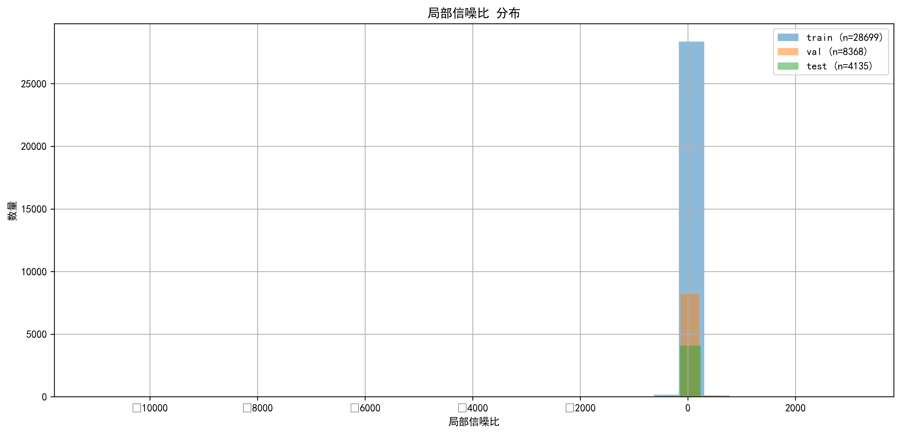
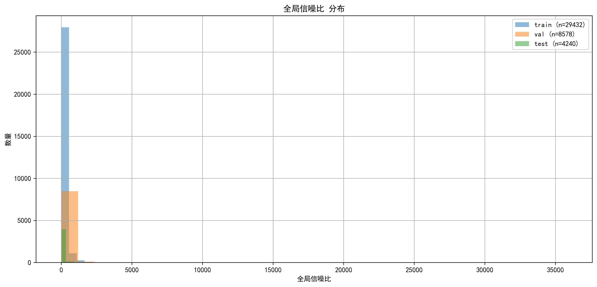

# IRTiny-BD-10K: Infrared Tiny Bright/Dark Target Dataset

# 🌟 Overview

IRTiny-BD-10K is a large-scale dataset specifically constructed for infrared tiny bright/dark target detection tasks, comprising 10,000 high-quality infrared images. This dataset aims to advance research and development in infrared small target detection algorithms, particularly in complex backgrounds and multi-target scenarios.

# ✨ Key Features

&emsp;&emsp;🔍 Extremely Small Target Size

&emsp;&emsp;&emsp;&emsp;  · Average target size: 8-9 pixels

&emsp;&emsp;&emsp;&emsp;  · Typical long-range infrared target characteristics

&emsp;&emsp;&emsp;&emsp;  · Small target-to-image ratio consistent with real scenarios

&emsp;&emsp;📏 Standard Resolution Format

&emsp;&emsp;&emsp;&emsp;  · All images: 640×512 pixels

&emsp;&emsp;&emsp;&emsp;  · Compatible with mainstream infrared detectors

&emsp;&emsp;🎯 Random Multi-Target Distribution

&emsp;&emsp;&emsp;&emsp;  · 1-7 randomly distributed targets per image

&emsp;&emsp;&emsp;&emsp;  · Various formation-based target arrangements

&emsp;&emsp;🌌 Realistic Physical Scene Modeling

&emsp;&emsp;&emsp;&emsp;  · Physical modeling of dark targets in strong radiation backgrounds

&emsp;&emsp;&emsp;&emsp;  · Ensures physical authenticity and reliability

&emsp;&emsp;🏞️ Diverse Background Library

&emsp;&emsp;&emsp;&emsp;  · Combined collected and simulated data

&emsp;&emsp;&emsp;&emsp;  · Includes strong light sources (moon, sun)

&emsp;&emsp;&emsp;&emsp;  · Enhanced coverage of high-brightness scenarios

&emsp;&emsp;🎲 High Diversity

&emsp;&emsp;&emsp;&emsp;  · Random combinations of targets and backgrounds

&emsp;&emsp;&emsp;&emsp;  · Significantly increased complexity

# 📥 Download
​​

&emsp;&emsp;  Download Method​​: Baidu Netdisk

&emsp;&emsp;  · ​​Link​​: https://pan.baidu.com/s/1rsxQbAnjj_vKS0Z58eDZ3Q

&emsp;&emsp;  · Extraction Code​​: as1j

# 📊 Performance Comparison Table
The following table presents the quantitative results of 14 models on the SIRST dataset. The best performance for each metric is ​​bolded​​, and the second best is <u>underlined</u>.

No. | Models | mIoU	| F1 | PD	| ROC-AUC	| PR-AUC | PR-AP

1	ABCNet 0.7460	0.8545	0.8447	0.9327	0.8471	0.8093

2	AGPCNet 0.7190	0.8366	0.8563	0.9427	0.8306	0.7935

3	DNANet 0.7455	0.8542	0.8730	0.9232	0.8369	0.7826

4	FC3Net 0.6936	0.8191	0.8358	0.9437	0.8159	0.7825

5	GEFPN 0.7193	0.8367	0.8483	0.9361	0.7964	0.7399

6	GGLNet 0.7307	0.8444	0.8700	0.9896	0.8557	0.8139

7	L2SKNet 0.7125	0.8321	0.8528	0.9163	0.8224	0.7849

8	LCAENet 0.7320	0.8453	0.8429	0.9389	0.8530	0.8246

9	LRNet 0.6976	0.8219	0.8560	0.9253	0.8048	0.7359

10	LW_IRST 0.6567	0.7927	0.7902	0.9574	0.8062	0.7798

11	MRF3Net 0.7339	0.8466	0.8760	0.9232	0.8353	0.7828

12	MSHNet 0.7414	0.8515	0.8608	0.9591	0.8415	0.7540

13	RDIAN 0.7154	0.8341	0.8414	0.9515	0.8464	0.8112

14	SCTransNet 0.7409	0.8512	0.8364	0.9276	0.8433	0.8053

# 🎯 Applications

This dataset is suitable for research in:

&emsp;&emsp;  Infrared small target detection

# 📊 Dataset Statistics

&emsp;&emsp;  · total_images = 10000

&emsp;&emsp;  · resolution = (640, 512)

&emsp;&emsp;  · targets_per_image = [1, 7]  # Range

&emsp;&emsp;  · avg_target_size = (8, 9)    # Pixels

# 📋 Usage Guidelines

&emsp;&emsp;  · This dataset is intended for ​​academic research only​​

&emsp;&emsp;  · Users must comply with relevant laws and academic norms

&emsp;&emsp;  · Appropriate citation is required

&emsp;&emsp;  · Not for commercial use without permission

# 📚 Citation

If you use this dataset in your research, please cite our technical paper:

&emsp;&emsp; @article{IRTiny-BD-10K,
  
  &emsp;&emsp; &emsp;&emsp; title={Infrared small target segmentation networks: A survey},
 
  &emsp;&emsp; &emsp;&emsp; author={Kou, Renke and Wang, Chunping and Peng, Zhenming and Zhao, Zhihe and Chen, Yaohong and Han, Jinhui and Huang, Fuyu and Yu, Ying and Fu, Qiang},
 
  &emsp;&emsp; &emsp;&emsp; journal={Pattern recognition},

  &emsp;&emsp; &emsp;&emsp; volume={143},
  
  &emsp;&emsp; &emsp;&emsp; pages={109788},
  
  &emsp;&emsp; &emsp;&emsp; year={2023},
  
  &emsp;&emsp; &emsp;&emsp; publisher={Elsevier}
 
  &emsp;&emsp; &emsp;&emsp; note = {The paper has not been published yet. If using this dataset, please temporarily cite the reference}
  
&emsp;&emsp; &emsp;&emsp; }

# ⚠️ Disclaimer

&emsp;&emsp;  This dataset was created through a combination of collected and simulated data. The creators are not responsible for any direct or indirect losses resulting from the use of this dataset.

# 🤝 Contributing

&emsp;&emsp;  We welcome contributions and suggestions! Please feel free to:

&emsp;&emsp;  Report issues with the dataset

&emsp;&emsp;  Suggest improvements or additional features

&emsp;&emsp;  Share your research results using this dataset

# 📞 Contact

&emsp;&emsp;  For questions about this dataset, please contact:

&emsp;&emsp;  Email: [krkoptics@163.com]

# IRTiny-BD-10K: 红外微小亮暗目标检测数据集

# 🌟 概述

IRTiny-BD-10K 是一个专门为红外微小亮/暗目标检测任务构建的大规模数据集，包含10,000张高质量红外图像。本数据集旨在推动红外微小目标检测算法的研究与发展，特别是在复杂背景和多目标场景下的性能。注：该数据集是通过“基于物理驱动高拟真红外弱小目标图像生成系统”构建。

# ✨ 主要特点

&emsp;&emsp;🔍 极小目标尺寸

&emsp;&emsp;&emsp;&emsp;  · 单个目标的平均像素范围在8~9像素之间

&emsp;&emsp;&emsp;&emsp;  · 具备远距红外微小目标的典型特征

&emsp;&emsp;&emsp;&emsp;  · 目标在图像中的占比较小，符合真实远距探测场景

&emsp;&emsp;📏 标准分辨率格式

&emsp;&emsp;&emsp;&emsp;  · 所有图像分辨率均为640×512像素

&emsp;&emsp;&emsp;&emsp;  · 符合当前主流红外探测器的分辨率特性

&emsp;&emsp;🎯 多目标随机分布

&emsp;&emsp;&emsp;&emsp;  · 每张图像中包含1~7个不等的微小目标

&emsp;&emsp;&emsp;&emsp;  · 包含多类型编队形式的目标排列

&emsp;&emsp;🌌 真实物理场景建模

&emsp;&emsp;&emsp;&emsp;  · 通过物理模型构建符合真实物理场景的暗目标

&emsp;&emsp;&emsp;&emsp;  · 确保目标特征的物理真实性和可靠性

&emsp;&emsp;🏞️ 多样化背景库

&emsp;&emsp;&emsp;&emsp;  · 通过采集和仿真相结合的方式

&emsp;&emsp;&emsp;&emsp;  · 扩展了包含强光源（月亮和太阳）的背景图像

&emsp;&emsp;&emsp;&emsp;  · 增强了对高亮度背景场景的覆盖

&emsp;&emsp;🎲 高度多样性

&emsp;&emsp;&emsp;&emsp;  · 采用仿真目标与目标库随机组合的策略

&emsp;&emsp;&emsp;&emsp;  · 极大增加了目标与背景的多样性和复杂性

# 📥 数据集下载
​​

&emsp;&emsp;  下载方式​​: 百度网盘

&emsp;&emsp;  · 链接​​: https://pan.baidu.com/s/1rsxQbAnjj_vKS0Z58eDZ3Q

&emsp;&emsp;  ​​· 提取码​​: as1j

# 🎯 应用领域

&emsp;&emsp;  本数据集适用于以下研究方向：

&emsp;&emsp;  · 红外小目标检测

# 📊 数据集统计

&emsp;&emsp;  total_images = 10000        # 总图像数量

&emsp;&emsp;  resolution = (640, 512)     # 分辨率

&emsp;&emsp;  targets_per_image = [1, 7]  # 每图像目标数量范围

&emsp;&emsp;  avg_target_size = (8, 9)    # 平均目标尺寸(像素)

# 📋 使用说明

&emsp;&emsp;  · 本数据集仅供学术研究使用

&emsp;&emsp;  · 使用请遵守相关法律法规和学术规范

&emsp;&emsp;  · 需要正确引用来源

&emsp;&emsp;  · 未经许可不得用于商业用途

# 📚 引用格式

&emsp;&emsp;  如果您在研究中使用了本数据集，请引用相关技术论文：

&emsp;&emsp; @article{IRTiny-BD-10K,
  
  &emsp;&emsp; &emsp;&emsp; title={Infrared small target segmentation networks: A survey},
 
  &emsp;&emsp; &emsp;&emsp; author={Kou, Renke and Wang, Chunping and Peng, Zhenming and Zhao, Zhihe and Chen, Yaohong and Han, Jinhui and Huang, Fuyu and Yu, Ying and Fu, Qiang},
 
  &emsp;&emsp; &emsp;&emsp; journal={Pattern recognition},

  &emsp;&emsp; &emsp;&emsp; volume={143},
  
  &emsp;&emsp; &emsp;&emsp; pages={109788},
  
  &emsp;&emsp; &emsp;&emsp; year={2023},
  
  &emsp;&emsp; &emsp;&emsp; publisher={Elsevier}
 
  &emsp;&emsp; &emsp;&emsp; note = {论文暂时未发布，如使用该数据集，请暂时引用该文献}

&emsp;&emsp; &emsp;&emsp; }

# ⚠️ 免责声明

&emsp;&emsp;  本数据集通过采集和仿真相结合的方式制作，致力于提供高质量的研究数据。制作者不对使用本数据带来的任何直接或间接损失负责。

# 🤝 贡献

&emsp;&emsp;  · 我们欢迎贡献和建议！请随时：

&emsp;&emsp;  · 报告数据集问题

&emsp;&emsp;  · 提出改进建议或新功能

&emsp;&emsp;  · 分享使用本数据集的研究成果

# 📞 联系方式

&emsp;&emsp;  如有关于本数据集的问题，请联系：

&emsp;&emsp;  邮箱: [krkoptics@163.com]

<em>如果觉得这个数据集有用，请给它一个星标 ⭐！</em>

